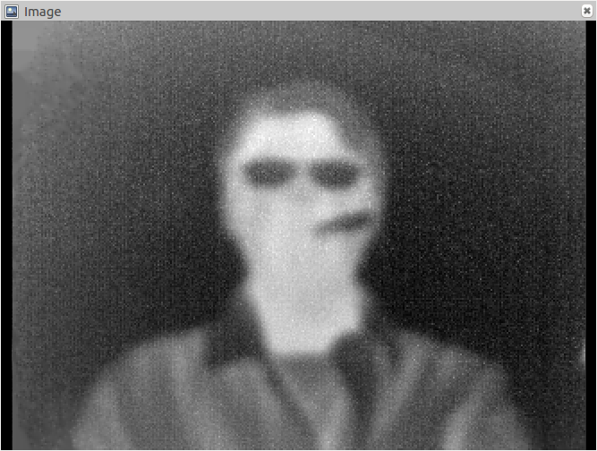

# seek_camera_ros
This is a ROS package for transfer Seek Compact Pro camera image to ROS message

## Requirement
- Ubuntu 16.04
- ROS Kinetic

## Camera driver
We use [libseek-thermal](https://github.com/maartenvds/libseek-thermal) as camera driver, their github page show the usage method.

Note: Before you connect your camera to computer by using usb port, you have to write a udev rule(I have putted it on the package, file name is: seek.rules):
```
sudo cp seek.rules /etc/udev
```

## The usage of ROS package
- Create an catkin workspace and download the package
  ```
  mkdir -p catkin_ws/src
  cd catkin_ws/src
  git clone https://github.com/KuangHaofei/seek_camera_ros.git
  catkin_init_workspace
  cd ..
  catkin_make
  ```

- Connect camera with USB, and setting interface according to [libseek-thermal](https://github.com/maartenvds/libseek-thermal)'s README

- Running Code
  1. Open a terminator, tyep:
      ```
      roscore
      ```
  2. Open a new terminator running seek ros:
      ```
      cd catkin_ws
      source devel/setup.bash
      rosrun seek_ros seek_ros_node
      ```
  3. Open a new terminator, and launch rviz:
      ```
      rosrun rviz rviz
      ```
      Choose `/seek_camera` topic, select `Image`, you will see:
      
